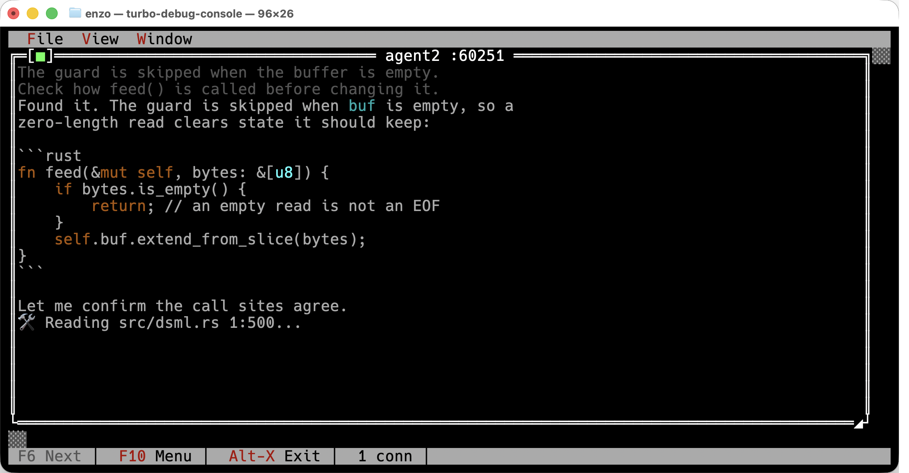

# turbo-debug-console

A Turbo Vision debug console for live token streams.

Point it at a port, stream bytes at it, and watch them render the way a terminal
agent would render them — markdown, fenced code with syntax highlighting,
thinking text dimmed, tool-call banners — inside a DOS-era text-mode UI with
menus, windows and a status line.

It exists because a model's token stream is hard to watch while it is happening.
Piping it to a file loses the formatting; piping it to a terminal loses it the
moment anything else prints. This gives the stream its own window, keeps a
scrollback, and survives the producer disconnecting and coming back.



## Install

```sh
brew install aovestdipaperino/tap/turbo-debug-console
```

Or from crates.io:

```sh
cargo install turbo-debug-console
```

## Use

Run it:

```sh
turbo-debug-console
```

It listens on **port 7878**. Then stream something at it:

```sh
printf 'HELLO 1 tokens build\n' | nc 127.0.0.1 7878     # -> PORT 54312
your-program | nc 127.0.0.1 54312
```

Or skip the handshake entirely — anything that is not a handshake is treated as
a raw token stream and gets its own window:

```sh
cat capture.txt | nc 127.0.0.1 7878
```

## Sessions

The handshake exists so a stream can be **named**, **reconnected to**, and told
apart by **kind**.

```
client -> control 7878 :  HELLO <version> <kind> <name>\n
server ->              :  PORT <n>\n              (or  ERR <reason>\n)
client -> data <n>     :  raw bytes, until the socket closes
```

`<kind>` is `tokens` (a model token stream, the default for the no-handshake
fallback above) or `trace` (see [Tracing streams](#tracing-streams) below).

A session outlives its data socket. When the producer drops, its window stays,
titled `[disconnected]`, with the transcript intact — and the same port keeps
listening. Sending `HELLO` again with the same name returns the same port, and
the stream rejoins its original window below a `-- reconnected --` rule.

That is the point: restart the program you are debugging as many times as you
like, and its output keeps accumulating in one place.

Sessions that stay disconnected are reaped after 30 minutes.

### Protocol version

The version is the first field of the handshake so that a client and a console
of different vintages fail loudly instead of misparsing each other. The current
version is `1`. A console that does not speak the version a client asks for
replies `ERR unsupported protocol version <v>` and closes, rather than guessing.

## Tracing streams

Point a Rust program's [`tracing`](https://crates.io/crates/tracing) output
straight at a window with the `trace` kind:

```sh
printf 'HELLO 1 trace myapp\n' | nc 127.0.0.1 7878     # -> PORT 54312
```

then, in `myapp`, write its `tracing-subscriber` JSON records to that port
instead of stdout:

```rust
let socket = std::net::TcpStream::connect("127.0.0.1:54312")?;
tracing_subscriber::fmt().json().with_writer(socket).init();
```

Each JSON record becomes one line, colored by level:

```
12:04:01  WARN  myapp::db   retry  attempt=3
```

the time-of-day in gray, the level in its own color (`ERROR` red, `WARN`
yellow, `INFO` white, `DEBUG` light gray, `TRACE` dark gray), the target in
cyan, the message in the default color, and any other structured fields
dimmed as `key=value` pairs after it. A line that isn't valid JSON — a stray
panic message, a `println!` that snuck onto the same socket — is shown
verbatim rather than dropped.

## Keys

| | |
|---|---|
| `F10` | menu |
| `F6` | next window |
| `Alt-X` | quit |
| `PgUp` / `PgDn` / `Home` / `End` | scroll the focused window |
| drag (left mouse) | select text in the focused window |
| `Esc` | clear the selection |

Long lines wrap to the window's width rather than being cut off, so there is
nothing to scroll horizontally to; scrolling is vertical only, by display
row. Scrolling back releases autoscroll; `End` re-arms it, so a window you
are reading does not yank itself to the bottom when new output arrives.

Drag with the left mouse button to select text; the selection follows the
mouse and survives scrolling. A selection spanning wrapped lines copies back
as the original logical lines — a soft wrap does not become a newline. A
plain click, `Esc`, or new output on that window clears it.

**File** opens a saved capture into a new window, or writes the focused
window's transcript out as plain text. **Edit** copies the current selection
to the clipboard, selects the whole window, and clears a window; thinking
text and markdown rendering are always on, not toggles. **Window** cycles,
tiles and cascades, and **Cleanup** closes every window whose client has gone
away — the ones whose titles read `[disconnected]` — in one go. That is worth
having because a new window covers the whole desktop, so older windows sit
hidden behind the newest one; Cleanup sweeps the dead ones without hunting
through the stack. Closing a window also tears its session down, releasing
the port.

Menu items grey out when they have nothing to act on: Copy until something is
selected, Save As / Select All / Clear window until a window is focused,
Cleanup until a window has actually lost its client, and Next / Tile / Cascade
until there is more than one window. There is no Window > Close item — a
window closes from the close box on its own frame.

## How it renders

The rendering is not a reimplementation. It runs
[`trace-stream`](https://crates.io/crates/trace-stream) — the same streaming
renderer the [plank](https://github.com/aovestdipaperino/plank) agent uses for
its own terminal output — over a `Vec<u8>`, and converts the ANSI it emits into
Turbo Vision cells. Same state machine, so the two cannot drift.

Text styles come through, not just colour. Since Turbo Vision 2.2 a cell
carries a style bitset alongside its colours, so ANSI **bold**, *italic* and
underline survive: keyword highlighting renders bold, comments italic, and
dimmed thinking text keeps its slant. Bold on an explicitly-chosen colour
keeps that colour's hue rather than brightening it.

## Build from source

```sh
git clone https://github.com/aovestdipaperino/turbo-debug-console
cd turbo-debug-console
cargo build --release
```

Built on [turbo-vision](https://crates.io/crates/turbo-vision), a Rust
implementation of Borland's text-mode UI framework.

## License

MIT — see [LICENSE](LICENSE).
